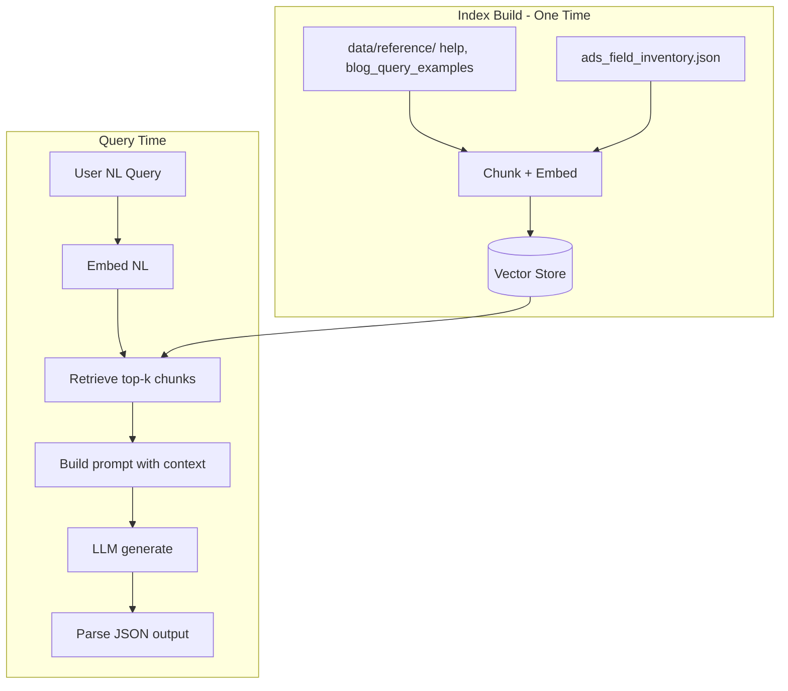

# RAG Layer for LLM (Additive Plan)

## Scope

**Keep the existing hybrid architecture.** Add RAG only to the LLM path. No changes to heuristics, merge logic, or assembler.

```
NL ──→ NER (heuristics) ──→ IntentSpec_NER ──┐
                                             ├─→ merge_intents() → assembler → query
NL ──→ [RAG: retrieve docs] ──→ LLM (with context) ──→ IntentSpec_LLM ──┘
```

---

## 1. What We're Adding

A retrieval step before the LLM call that injects relevant reference material into the prompt. The LLM gets better context (syntax, examples, field definitions) without any model retraining.

**No new LLM. No retraining.** RAG is additive — same fine-tuned model, retrieval step before the call.

---

## 2. Full Reference Inventory (data/reference/)

### High RAG Value

| Source | Content | Chunking |
|--------|---------|----------|
| **help/search.md** | Search syntax, operators, author parsing | By section |
| **help/data_faq.md** | Bibgroups, data FAQ | By section |
| **blog_query_examples.md** | ~101 curated query patterns | By example block |
| **data/model/ads_field_inventory.json** | Field definitions, enums | By field group |
| **Indexing and searching mentions.md** | mention_count, credit_count | By section |

### Medium RAG Value (Optional)

| Source | Content | Notes |
|--------|---------|-------|
| **blog/** (60 posts) | Advanced patterns | Key posts: 2020-08-10-myADS, 2024-07-01-data-linking-II, 2025-03-25-what-i-wish-i-knew |

### Low RAG Value (Use as Lookup Instead)

| Source | Content | Notes |
|--------|---------|-------|
| **aas_the-unified-astronomy-thesaurus_6-0-0.json** | UAT concepts | Already in uat_lookup; large |
| **Gazetteer CSV** | Planetary features | Large; better as lookup |

---

## 3. RAG Architecture



---

## 4. Implementation

### 4.1 Build Vector Index (one-time)

1. Chunk markdown by section; JSON by field group. Target 200–500 tokens/chunk.
2. Embed chunks with sentence-transformers (e.g., all-MiniLM-L6-v2).
3. Store in ChromaDB, FAISS, or LanceDB.

### 4.2 Query-Time Retrieval

1. Embed user NL query.
2. Retrieve top-3–5 chunks.
3. Format as `Reference:\n{chunk1}\n\n{chunk2}\n\n...`

### 4.3 Integration Point

**File**: [docker/server.py](docker/server.py)

In `generate_query()` or `_run_hybrid()`, before the LLM call:

```python
# Pseudocode
chunks = retrieve_relevant_docs(nl_query, k=3)
context = format_chunks(chunks)
prompt = f"{SYSTEM_PROMPT}\n\nReference:\n{context}\n\nQuery: {nl_query}\nDate: {date}"
# ... existing model.generate(prompt)
```

No changes to NER, merge, or assembler.

### 4.4 Effort Estimate

| Task | Effort |
|------|--------|
| Chunk data/reference/ | 1–2 days |
| Build vector index | 0.5 day |
| Retrieval + prompt injection | 1 day |
| Integration in server.py | 0.5 day |
| **Total** | **~4 days** |

---

## 5. Benchmark

**Benchmark**: [data/datasets/benchmark/benchmark_queries.json](data/datasets/benchmark/benchmark_queries.json) (301 tests)

**Script**: [scripts/evaluate_benchmark.py](scripts/evaluate_benchmark.py)

**Metrics**: Pass rate, exact match, syntax valid, constraint valid, forbidden patterns (by category)

**Comparison**:
1. **Baseline**: Run benchmark with current hybrid (no RAG). Save results.
2. **RAG**: Add RAG layer, run same benchmark. Save results.
3. Compare and document in `data/datasets/evaluations/rag_comparison_report.md`

```bash
python scripts/evaluate_benchmark.py --output data/datasets/evaluations/baseline.json
# Add RAG, then:
python scripts/evaluate_benchmark.py --output data/datasets/evaluations/rag.json
```

---

## 6. No New Training Data

RAG uses indexed documents only. No LLM fine-tuning required.

**Optional**: gold_examples for dynamic few-shot — retrieve similar NL→query pairs, add to prompt. Would extend retrieval.py for the LLM path. Effort: 1–2 days. Not required for initial RAG layer.

---

## 7. Grammar / Structured Output (Future, Independent of RAG)

If syntax errors persist after RAG, consider:

| Option | Effort | Benefit | Risk |
|--------|--------|---------|------|
| **IntentSpec output** | 2–3 days | Assembler guarantees valid query | LLM must learn IntentSpec schema |
| **Expand constrain.py** | 1–2 days | More repair rules (operator quoting, etc.) | Incremental; may not catch all |
| **Constrained decoding** | 1–2 weeks | Only valid query tokens generated | Requires EBNF for ADS; complex |
| **Formal grammar parser** | 1 week | Parse, report errors, optionally repair | ADS syntax is complex |

---

## 8. Phased Implementation

| Phase | Task | Effort |
|-------|------|--------|
| **Phase 1** | RAG layer (chunk, index, retrieve, integrate) | ~4 days |
| **Phase 2** | Optional: few-shot from gold_examples | 1–2 days |
| **Phase 3** | Optional: grammar (IntentSpec or constrain.py) | 2–4 days |
| **Phase 4** | Benchmark comparison report | 0.5 day |

---

## 9. Summary

| Item | Detail |
|------|--------|
| **Scope** | Add RAG to LLM only. Heuristics, merge, assembler unchanged. |
| **New LLM?** | No. Same fine-tuned model. |
| **Retraining?** | No. Index docs only. |
| **Sources** | data/reference/ help/, blog_query_examples, ads_field_inventory |
| **Integration** | Retrieve before LLM call; inject chunks into prompt |
| **Benchmark** | benchmark_queries.json + evaluate_benchmark.py |
| **Report** | data/datasets/evaluations/rag_comparison_report.md |
| **Effort** | Phase 1: ~4 days. Phases 2–4 optional. |
| **Grammar** | Optional future: IntentSpec output or expand constrain.py |
