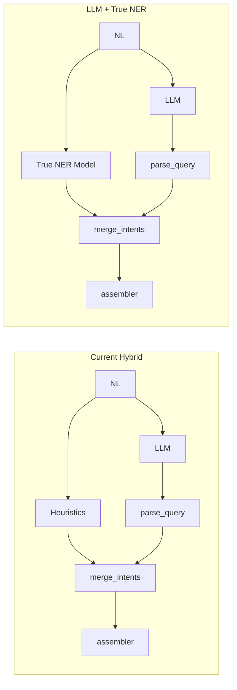

# True NER Implementation Audit and Plan

## Executive Summary

**Recommendation: Proceed with caution.** True NER would add marginal value for a subset of entities (authors, affiliations, astronomical objects) but requires significant investment in training data. The current heuristic + LLM hybrid already covers most cases well. A phased approach—starting with out-of-box NER as an *optional supplement* and only investing in custom training if metrics justify it—is the most cost-effective path.

---

## 1. Current State: What the Heuristics Do Well vs. Fail

### Entity Types and Current Coverage

| Entity Type                      | Heuristic Method                                   | Merge Preference | Gaps                                                                                  |
| -------------------------------- | -------------------------------------------------- | ---------------- | ------------------------------------------------------------------------------------- |
| **Authors**                      | Regex: `by X`, `author X`, `X et al.`              | NER preferred    | Misses "Hawking's papers", "Einstein's work" (possessive), "Smith 2020" (author-year) |
| **Years**                        | Regex: 15+ patterns (range, since, decade, last N) | NER if extracted | Very few gaps; regex is comprehensive                                                 |
| **Affiliations**                 | `institution_synonyms.json` + context words        | NER preferred    | Misses novel phrasings; ~56 institutions only                                         |
| **Bibstems**                     | `bibstem_synonyms.json` + context                  | NER preferred    | ~70 journals; ambiguous names (Nature, Science) need context                          |
| **Bibgroups**                    | `BIBGROUP_SYNONYMS` dict                           | Union            | "Hubble" in "Hubble constant" vs telescope—blocklist exists                           |
| **Objects**                      | **Not extracted by NER**                           | LLM only         | M31, Crab Nebula—LLM handles; no heuristic                                            |
| **Operators**                    | 80+ regex patterns, strict gating                  | LLM preferred    | LLM handles nested/complex; heuristics avoid false positives                          |
| **Topics**                       | Residual text after extraction                     | LLM preferred    | Heuristics = stopword removal; LLM understands context                                |
| **Negation, has:, grant:, ack:** | **Not in NER**                                     | LLM only         | Heuristics cannot detect these                                                        |

### Where True NER Could Help

1. **Authors without trigger words**: "Hawking's papers", "Einstein's black holes", "Smith 2020" — spaCy PERSON would find "Hawking", "Einstein", "Smith" as spans. **Risk**: "Hawking" in "Hawking radiation" is a false positive.
2. **Affiliations**: spaCy ORG finds "MIT", "Stanford" — but we still need `institution_synonyms` to map to `inst:` canonical form. **Risk**: "Cambridge" (city vs university).
3. **Astronomical objects**: No standard NER type. M31, Crab Nebula — domain-specific. astroECR corpus exists but is for abstract text, not search queries.
4. **Dates**: spaCy DATE — heuristics already cover "last 5 years", "since 2020". Marginal gain.

---

## 2. Would LLM + True NER Add Value?

### Value Proposition

**Expected gains:**

- **Authors**: +5–15% recall on possessive/variant phrasings (e.g., "Schmidt's work")
- **Affiliations**: +10–20% on institutions not in synonym list, if we add fuzzy ORG→inst mapping
- **Objects**: +20–30% if we train/fine-tune for ASTRONOMICAL_OBJECT (currently LLM-only)

**Expected costs:**

- Latency: +50–200ms per request (spaCy small ~20ms; transformer NER ~100–200ms)
- Disambiguation errors: PERSON/ORG false positives (e.g., "Hubble" as ORG when it's cosmology)
- Maintenance: New model versioning, dependency (spaCy/HF), evaluation pipeline

### Verdict

**Marginal value.** The LLM already handles most of what NER would add. The merge logic prefers NER for authors/affiliations/bibstems because heuristics *validate* against known lists—true NER would produce raw spans that still need validation and canonical mapping. The main win would be **astronomical object** extraction (currently 100% LLM) and **author recall** on possessive forms.

---

## 3. Training Data: Can We Derive It? How Hard?

### Option A: Derive from gold_examples.json

**Idea**: Parse `ads_query` → extract values (author, year, bibstem, etc.). Find substring matches in `natural_language` → produce (start, end, label) spans.

**Feasibility**:

- **Authors**: "author:Schmidt" → search "Schmidt" in NL. Works for "Schmidt's work" (exact). Fails for "Schmidt et al." (regex captures differently). **~60% of author examples** likely derivable.
- **Years**: "pubdate:2016" → search "2016" in NL. High success rate.
- **Affiliations**: "inst:MIT" → search "MIT" or synonym. Moderate.
- **Objects**: "object:Crab Nebula" → search "Crab Nebula". Good for explicit object field.
- **Topics**: "abs:black holes" → "black holes" in NL. Many compound cases (multiple abs:) make alignment hard.

**Implementation**: Script that:

1. Uses [parse_query.py](packages/finetune/src/finetune/domains/scix/parse_query.py) logic (or regex) to extract field values from `ads_query`
2. For each value, finds all occurrences in `natural_language` (case-insensitive, word-boundary)
3. Resolves conflicts (e.g., "Hubble" in query: bibgroup vs topic)
4. Outputs spaCy format: `(text, {"entities": [(start, end, "AUTHOR"), ...]})`

**Effort**: 2–3 days for script + filtering. Expect **2,000–3,000** usable examples from 4,924, with ~20–30% noise requiring manual review.

### Option B: Manual Annotation

**Format**: BIO/BILOU or spaCy `(text, {"entities": [...]})`. Labels: AUTHOR, AFFILIATION, YEAR, BIBSTEM, BIBGROUP, OBJECT, TOPIC (optional).

**Effort**:

- 100 examples: ~4–6 hours (one annotator, 2–3 min/example)
- 500 examples: ~20–25 hours
- 1,000+ for production: ~40–50 hours
- **Inter-annotator agreement** and guidelines add 20–30% overhead

### Option C: LLM-Assisted Annotation

Use GPT-4/Claude to propose spans from (nl, query) pairs. Human review for quality. **Faster** than full manual but still needs review (~1 min/example). 1,000 examples ≈ 15–20 hours total.

### Recommendation

**Start with Option A (derivation)**. Build the derivation script, validate on a sample, measure precision/recall. If quality is acceptable (>85% precision), use for initial NER training. Option C for gap-filling if derivation misses important patterns.

---

## 4. Out-of-Box vs. Custom Models

### Out-of-Box Options

| Model                               | Entity Types                 | Pros                            | Cons                                                                 |
| ----------------------------------- | ---------------------------- | ------------------------------- | -------------------------------------------------------------------- |
| **spaCy en_core_web_sm**            | PERSON, ORG, DATE, GPE, etc. | Fast (~20ms), no training       | PERSON/ORG only; no BIBSTEM, BIBGROUP, OBJECT; disambiguation errors |
| **spaCy en_core_web_trf**           | Same                         | Better accuracy                 | Slower (~100ms), larger                                              |
| **HuggingFace dslim/bert-base-NER** | PER, ORG, LOC, MISC          | Good baseline                   | Same label gaps                                                      |
| **Flair NER**                       | Standard                     | State-of-art on some benchmarks | Heavier dependency                                                   |

**Use case for out-of-box**: Run spaCy `en_core_web_sm` in parallel with heuristics. If spaCy finds PERSON not in heuristic authors → add to candidate list with lower confidence. Merge can use as fallback. **No training, low risk.**

### Domain-Specific Models

| Source               | Domain                  | Entity Types                         | Availability                            |
| -------------------- | ----------------------- | ------------------------------------ | --------------------------------------- |
| **astroECR**         | Astrophysics abstracts  | Celestial objects, instruments, etc. | Research corpus; model not pre-packaged |
| **SciNER**           | Scientific text         | Custom scientific entities           | Paper/code; may need adaptation         |
| **DEAL shared task** | Astrophysics literature | Entity detection                     | Workshop; check for released models     |

**Reality**: No plug-and-play astronomy NER for *search query* intent. astroECR is for *abstract* text. We would need to train our own for OBJECT, BIBGROUP, BIBSTEM if we want model-based extraction for those.

### Custom Training (If We Proceed)

**Labels to support**:

- AUTHOR (or reuse PERSON with validation)
- AFFILIATION (or ORG + inst lookup)
- YEAR (or DATE)
- BIBSTEM, BIBGROUP (custom)
- OBJECT (custom, astronomical)
- TOPIC (optional; often "everything else")

**Framework**: spaCy v3 or HuggingFace token classification (BERT, RoBERTa). spaCy is easier for pipeline integration; HF is more flexible.

**Data need**: 500–1,000 examples per label for reasonable performance. AUTHOR/YEAR have most examples; OBJECT has ~87 in gold; BIBSTEM ~466.

---

## 5. Implementation Plan (Phased)

### Phase 1: Out-of-Box NER as Optional Supplement (Low Effort)

**Goal**: Add spaCy as fallback for authors without changing merge semantics.

1. Add `spacy` to [docker/requirements.txt](docker/requirements.txt)
2. In [ner.py](packages/finetune/src/finetune/domains/scix/ner.py): after `_extract_authors()`, if authors list is empty, run `nlp(nl_text).ents`, filter for `PERSON`, exclude if span text in AUTHOR_NOISE_WORDS or matches topic-like patterns (e.g., "Hawking" adjacent to "radiation").
3. Add confidence penalty (e.g., 0.6) for spaCy-sourced authors so merge can prefer LLM if both present.
4. **Evaluation**: A/B test on val set or sample queries. Measure author recall before/after.

**Effort**: 1–2 days. **Risk**: Low.

### Phase 2: Derive NER Training Data from gold_examples

**Goal**: Produce spaCy-format training data without manual annotation.

1. Implement `scripts/derive_ner_annotations.py`:
  - Parse `ads_query` for author, year, bibstem, object, affiliation (reuse parse_query or regex)
  - For each, find span in `natural_language` (substring, word boundary)
  - Handle multi-value (e.g., two authors)
  - Output `(text, {"entities": [...]})` JSONL
2. Validate on 100 random examples (manual spot-check)
3. Report precision/recall by entity type

**Effort**: 2–3 days.

### Phase 3: Train/Fine-Tune NER (If Phase 1–2 Show Promise)

**Goal**: Custom model for AUTHOR, OBJECT, optionally BIBGROUP.

1. Use Phase 2 data + Option C (LLM-assisted) for gaps
2. Fine-tune spaCy NER or HF token classifier
3. Integrate as alternative extractor in pipeline
4. Compare heuristic vs. model vs. hybrid on held-out eval set

**Effort**: 1–2 weeks (training, eval, integration). **Conditional** on Phase 1–2 metrics.

### Phase 4: Astronomical Object Specialization (Optional)

**Goal**: Improve object: field extraction (currently LLM-only).

1. Curate OBJECT examples from gold (category=astronomy, object=)
2. Consider astroECR or SIMBAD/NED name list for negative/positive examples
3. Fine-tune for OBJECT label or add as second-stage classifier

**Effort**: 2–3 weeks. **Conditional** on object extraction being a bottleneck.

---

## 6. Other Considerations

### Latency and Deployment

- Heuristics: <5ms
- spaCy sm: ~20ms; trf: ~100ms
- HF NER: ~50–150ms
- **Recommendation**: Run NER async with LLM; merge when both complete. Total latency = max(NER, LLM), not sum.

### Disambiguation

- "Hubble" → HST (telescope) vs. Hubble constant (topic). Heuristics use blocklist. NER would need similar post-processing.
- "Cambridge" → city vs. university. Context words help; NER ORG alone is insufficient.
- **Conclusion**: NER outputs raw spans; validation and mapping (institution_synonyms, bibstem_synonyms, blocklists) remain essential.

### Evaluation Metrics

- **Author recall**: % of gold authors found (by heuristic, NER, LLM, merged)
- **Author precision**: % of extracted authors that are correct
- **End-to-end**: Query correctness (syntax valid, returns expected results) — existing eval in [eval.py](packages/finetune/src/finetune/domains/scix/eval.py)

### Alternative: Improve Heuristics

Before investing in NER, consider:

- Add possessive author pattern: `(\w+)'s (?:work|papers|research)` → author
- Expand AUTHOR_PATTERNS for "Smith 2020" style
- Add more institution_synonyms
- **Effort**: 1–2 days. **May close 50%+ of author gaps** with zero model dependency.

---

## 7. Summary Table

| Question                        | Answer                                                                                                           |
| ------------------------------- | ---------------------------------------------------------------------------------------------------------------- |
| **Beneficial over heuristics?** | Marginal. Main gains: author recall (possessive), object extraction. Years/operators/enums already well handled. |
| **LLM + NER add value?**        | Small. LLM covers most; NER would mainly fill author/object gaps when LLM misses.                                |
| **Own training set?**           | Yes, for custom labels (OBJECT, BIBGROUP, BIBSTEM). Can derive ~2–3k examples from gold_examples.                |
| **How hard/time-consuming?**    | Derivation: 2–3 days. Manual 1k examples: ~40h. Full custom training: 1–2 weeks.                                 |
| **Out-of-box models?**          | Yes. spaCy PERSON/ORG/DATE can supplement authors/affiliations. No OBJECT, BIBSTEM, BIBGROUP.                    |
| **Domain-specific?**            | Needed for OBJECT. astroECR exists for abstracts, not queries. We'd train our own.                               |
| **First step?**                 | Phase 1: Add spaCy as optional author fallback. Phase 2: Derive training data. Re-evaluate before Phase 3.       |

